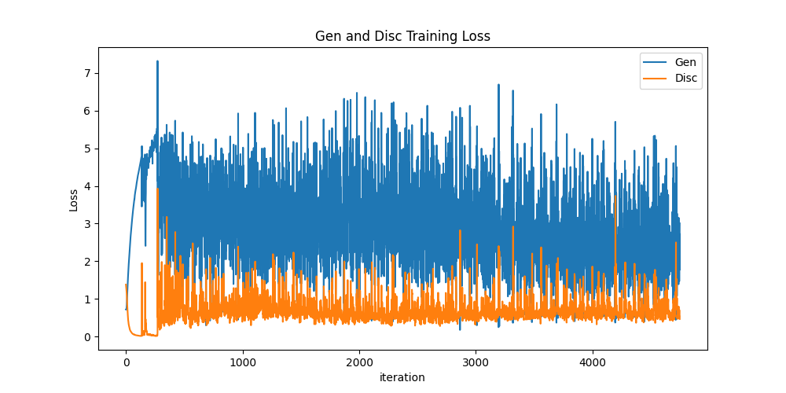

# DCGAN Model with PyTorch 

DCGAN (Deep Convolutional Generative Adversarial Network) is a type of GAN (Generative Adversarial Network) that utilizes convolutional and convolutional-transpose layers to generate more realistic images.

## Components of DCGAN

* Generator

  
  
* Discriminator

  

## Dataset

To train the model in this practice project, I used the "CelebA" dataset. You can see examples of the images in this dataset below.

_Sample images from CelebA Dataset_

### Outputs

* Gen and Disc training loss plot

  

* Animation Output (3 epochs)

  
