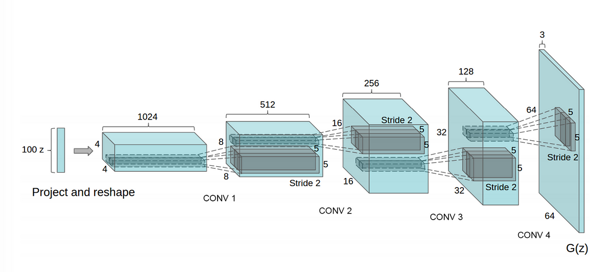
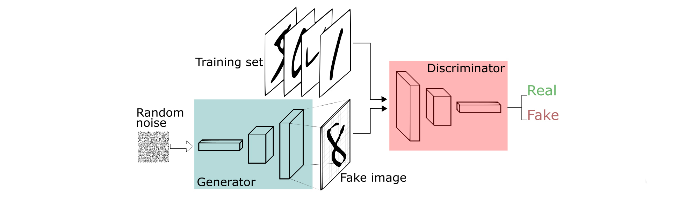
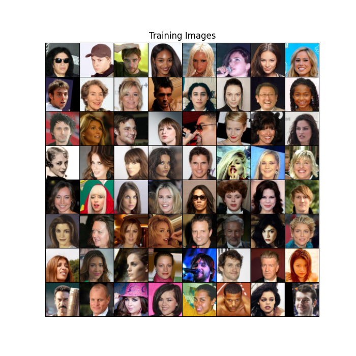

# DCGAN Model with PyTorch 

DCGAN (Deep Convolutional Generative Adversarial Network) is a type of GAN (Generative Adversarial Network) that utilizes convolutional and convolutional-transpose layers to generate more realistic images.

# Components of DCGAN

* Generator

  
  
* Discriminator

  

# Dataset

_Sample images from Celeba Dataset_

